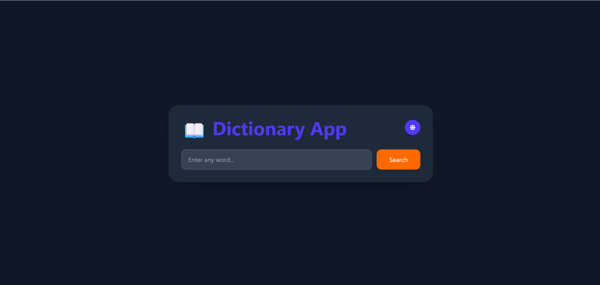
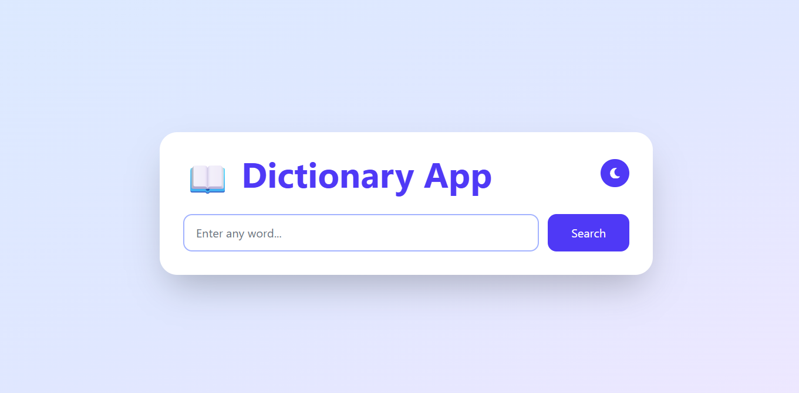
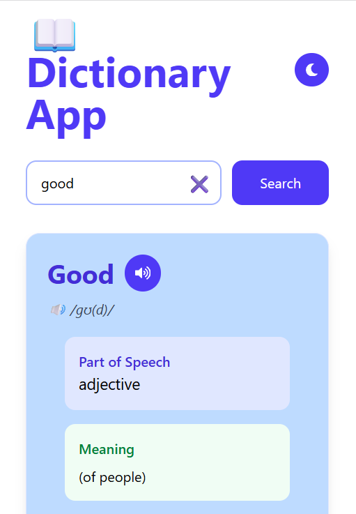
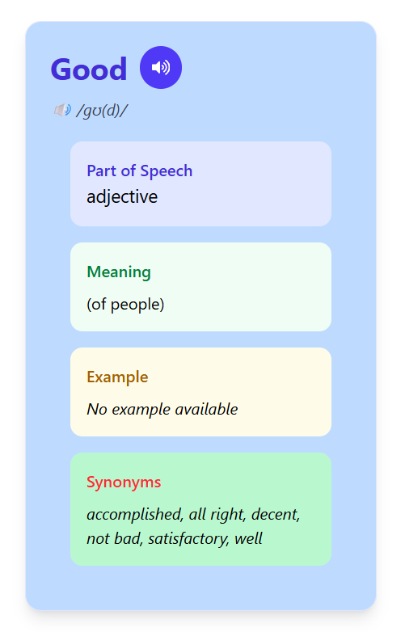

# 📖 Dictionary App

A modern and responsive Dictionary Application built using **React + Vite**.

## 🚀 Live Demo

🔗 **https://prismatic-bublanina-5688f9.netlify.app/**

---

## 📸 Project Preview

### 🌙 Dark Mode



### ☀️ Light Mode



### 📱 Mobile View





---

## ✨ Features

- 🔍 Search any English word
- 📖 Word Meaning & Definition
- 🔊 Audio Pronunciation
- 📝 Part of Speech
- 💡 Example Sentences
- 🔗 Synonyms
- 🌙 Light/Dark Theme
- 📱 Fully Responsive Design

---

## 🛠️ Tech Stack

- React.js
- Vite
- CSS3
- Dictionary API

---

## 📦 Installation

```bash
npm install
npm run dev
```
